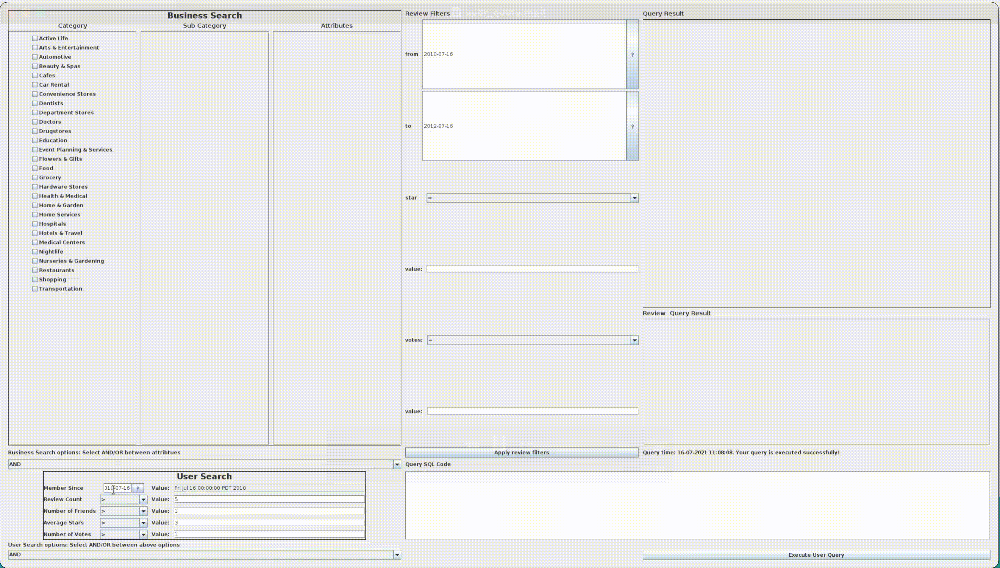

# Data Analysis Application for [Yelp.com](http://yelp.com/)

## Background

 In 2013, Yelp.com has announced the “Yelp Dataset Challenge” and invited students to use this data in an innovative way and break ground in research. This application is developed based on this challenge and aims to help local businesses and individual users to  query [Yelp.com](http://yelp.com/) dataset to extract useful information for local businesses and individual users. Since the real [Yelp.com](http://yelp.com/) data 
 
The Yelp data is available in JSON format. The original Yelp dataset includes 42,153 businesses, 252,898 users, and 1,125,458 reviews from Phoenix (AZ), Las Vegas (NV), Madison (WI) in United States and Waterloo (ON) and Edinburgh (ON) in Canada. (http://www.yelp.com/dataset_challenge/). In this project we used a smaller and simplified dataset. This simplified dataset includes only **20,544 **businesses, the reviews that are written for those businesses only, and the users that wrote those reviews.  

## Summary

This is a Java based application and coordinates with SQL to allow the users to query the database on the Yelp data and extracts useful information. The primary users for this application will be potential customers seeking for businesses and users that match their search criteria. 

This application has a user interface that provides the user the available business categories (main, sub-categories), the attributes associated with each business category along with business review and yelp user information associated with each business category. Using this application the user will search for the businesses from various business categories that have the properties (attributes) the user is looking for. 

## Technologies  

**“Faceted search** is a technique that involves augmenting traditional search techniques with a faceted navigation system, allowing users to narrow down search results by applying multiple filters based on [faceted classification](https://en.wikipedia.org/wiki/Faceted_classification) of the items.[[1]](https://en.wikipedia.org/wiki/Faceted_search#cite_note-Faceted_Search-1) A faceted classification system classifies each information element along multiple explicit dimensions, called facets, enabling the classifications to be accessed and ordered in multiple ways rather than in a single, pre-determined, [taxonomic](https://en.wikipedia.org/wiki/Taxonomy_(general)) order.[[1]](https://en.wikipedia.org/wiki/Faceted_search#cite_note-Faceted_Search-1)
Facets correspond to properties of the information elements. They are often derived by analysis of the text of an item using [entity extraction](https://en.wikipedia.org/wiki/Entity_extraction) techniques or from pre-existing fields in a database such as author, descriptor, language, and format. Thus, existing web-pages, product descriptions or online collections of articles can be augmented with navigational facets.“  
From: https://en.wikipedia.org/wiki/Faceted_search

## User interface display

## Sample queries 

Business Query

User Query

